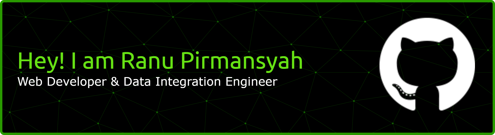

###

<h2 align="left">🛠️Tech Stack</h2>

###

<h4 align="left">💻 Programming Languages</h4>

###

  
  
  
  
  
  
  
  
  
  
  

###

<h4 align="left">⚙️ Frameworks & Libraries</h4>

###

  
  
  
  
  
  
  
  
  
  
  
  
  

###

<h4 align="left">🗄️ Database & Data Management</h4>

###

  
  
  
  
  
  
  
  
  
  
  

###
<h4 align="left">📢 Follow Me!</h4>

    
    

